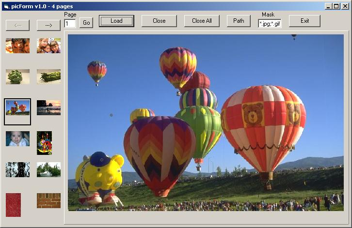



## picForm Image Viewer

### Description

(1) Shows images previewed as thumbs side by side.

(2) Makes any image fit within the main view window. (3) Drag and drop support for individual files or folders. (4) Includes a panic button feature. (5) Convenient, easy-to-use interface (see tips in readme.txt file).

-- Relatively small amount of code and well commented.

`

Feedback would be appreciated. Votes would be appreciated more.
 
### More Info
 

             |
---                |---
**Submitted On**   |2000-07-03 17:18:32
**By**             |[LJetH](https://github.com/Planet-Source-Code/PSCIndex/blob/master/ByAuthor/ljeth.md)
**Level**          |Intermediate
**User Rating**    |4.9 (34 globes from 7 users)
**Compatibility**  |VB 3\.0, VB 4\.0 \(16\-bit\), VB 4\.0 \(32\-bit\), VB 5\.0, VB 6\.0, VB Script, ASP \(Active Server Pages\) 
**Category**       |[Graphics](https://github.com/Planet-Source-Code/PSCIndex/blob/master/ByCategory/graphics__1-46.md)
**World**          |[Visual Basic](https://github.com/Planet-Source-Code/PSCIndex/blob/master/ByWorld/visual-basic.md)
**Archive File**   |[CODE\_UPLOAD7394732000\.zip](https://github.com/Planet-Source-Code/ljeth-picform-image-viewer__1-9452/archive/master.zip)

